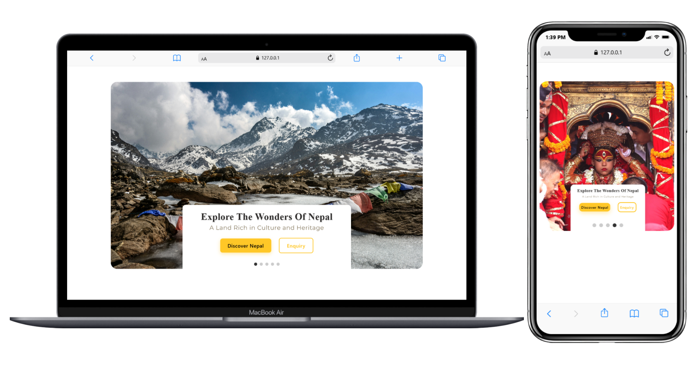

<p align="center">
  
</p>

# Nepal Wonders Showcase UI

**Nepal Wonders Showcase** is a visually captivating **image slider UI** built using  
**HTML, CSS, and JavaScript**.  
It highlights Nepal’s breathtaking culture, landscapes, and traditional heritage with smooth animations and an elegant information panel.

---

## 📸 Preview

<p align="center">
  
</p>

---

## 🔗 Live Demo

<p align="center">
  <a href="https://anujghimire08.github.io/NepalWondersShowcaseUI/">
    
  </a>
</p>

---

## ✨ Features

- Smooth **auto sliding** every 4 seconds
- Centered **title + subtitle box**
- Modern UI with **Google Fonts (Gloock, Montserrat)**
- Interactive **navigation dots**
- Two elegant buttons: _Discover Nepal_ & _Enquiry_
- Fully **responsive for mobile**
- Clean **JS logic** for slide transitions
- Beautiful **hover effects & shadows**

---

## 🛠️ Technologies Used

- **HTML5** – Layout & structure
- **CSS3** – Styling, shadows, responsive design
- **JavaScript (ES6)** – Slide switching logic
- **Google Fonts** – Modern Nepal-inspired typography

---

## 📁 Project Structure

```
Nepal-Wonders-Showcase/
│── index.html
│── style.css
│── script.js
│── images

```
